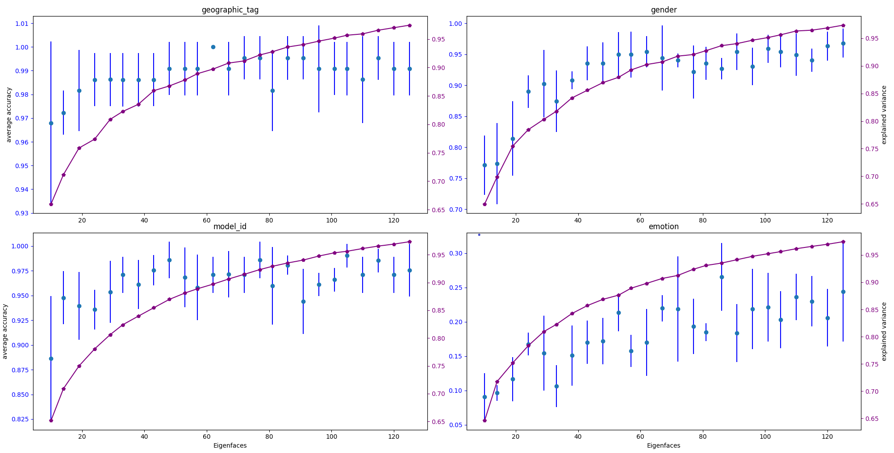
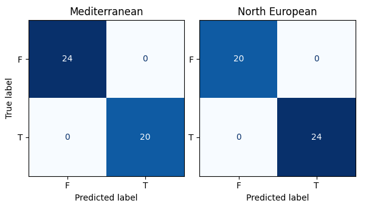
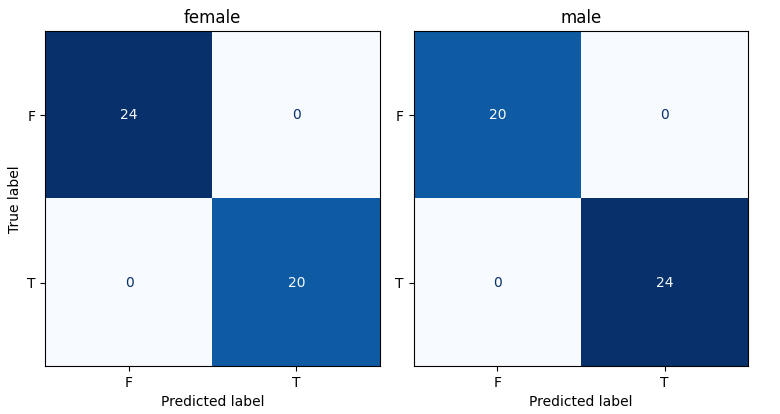
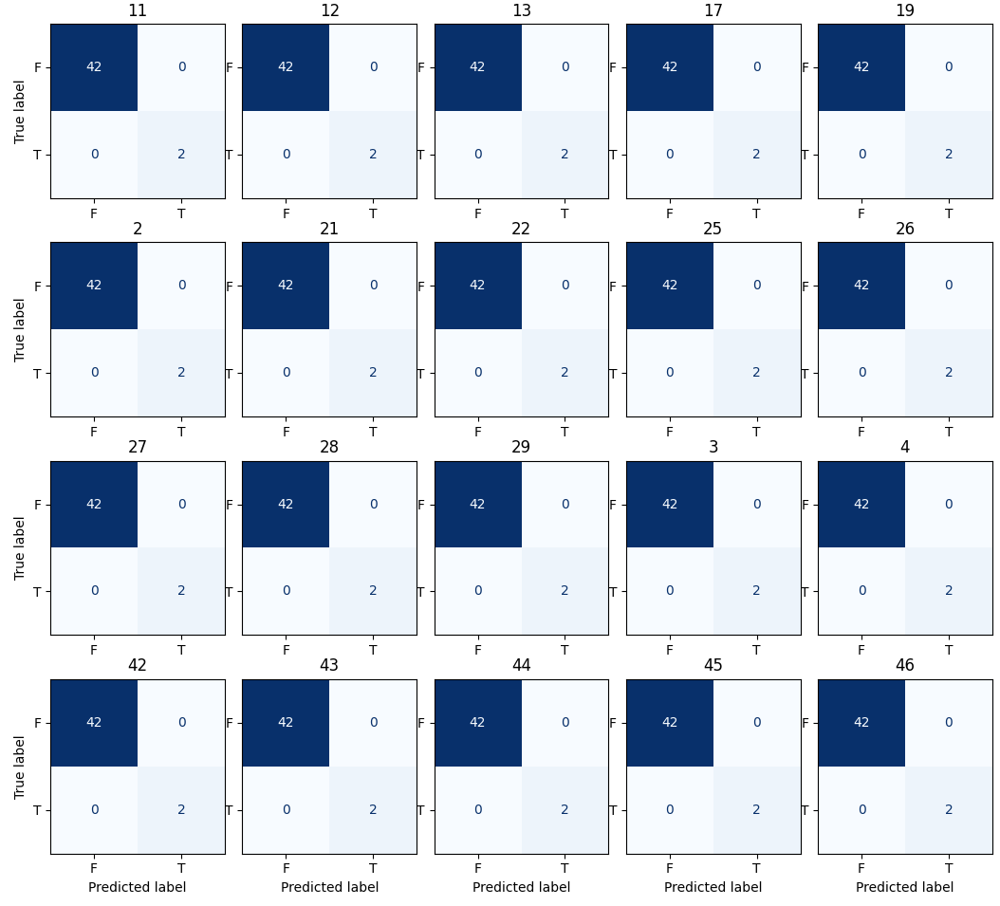

<!-- PROJECT LOGO -->
<br />
<p align="center">
  <a href="https://github.com/Eigenfaces-In-Image-Classification/repo_name">
    
  </a>

  <h3 align="center">A Study On The Efficacy of Using Eigenfaces In Image Classification</h3>

  <p align="center">
    The increased use of image classification in technology today has incited a rise in research and development for new approaches in facial detection and identification models. 
    Two common problems in image classification are storing large datasets and model training costs.
    One approach to achieving dimensionality reduction while maintaining performance is Principal Component Analysis where a subset of eigenvectors, also known in the domain of facial detection as ``eigenfaces'', are used to represent the data in a lower dimensionality space.
    This paper presents an image classification model based on eigenfaces and support vector machines using the Amsterdam Dynamic Facial Expression Set (ADFES) dataset. 
    Implementation of an image classification model is described, and performance analysis of the model is presented with a focus on the efficacy of using eigenfaces when training the model.
    <br />
    <a href="https://github.com/Eigenfaces-In-Image-Classification/repo_name"><strong>Explore the Repository »</strong></a>
    <br />
    <br />
    <a href="https://github.com/Eigenfaces-In-Image-Classification/repo_name/issues">Report Bug</a>
  </p>
</p>

Authors: Jacob Taylor Cassady and Dimitri Medina

<!-- TABLE OF CONTENTS -->
<details open="open">
  <summary><h2 style="display: inline-block">Table of Contents</h2></summary>
  <ol>
    <li><a href="#nomenclature">Nomenclature</a></li>
    <li><a href="#introduction">Introduction</a></li>
    <li><a href="#amsterdam-dynamic-facial-expression-set">Amsterdam Dynamic Facial Expression Set</a></li>
    <li><a href="#model">Model</a></li>
    <ol>
      <li><a href="#features-and-targets">Features and Targets</a></li>
      <li><a href="#principal-component-analysis">Principal Component Analysis</a></li>
      <li><a href="#support-vector-machine">Support Vector Machine</a></li>
    </ol>
    <li><a href="#implementation">Implementation</a></li>
    <ol>
      <li><a href="#data-processing">Data Processing</a></li>
      <li><a href="#model-implementation">Model Implementation</a></li>
    </ol>
    <li><a href="#analysis">Analysis</a></li>
    <ol>
      <li><a href="#eigenface-analysis">Eigenface Analysis</a></li>
      <li><a href="#model-analysis">Model Analysis</a></li>
    </ol>
    <li><a href="#discussion">Discussion</a></li>
    <li><a href="#future-work">Future Work</a></li>
    <li><a href="#acknolwedgements">Acknolwedgements</a></li>
    <li><a href="#referemces">References</a></li>
  </ol>
</details>

## Nomenclature 
| Abbreviation | Definition                                     |
|--------------|------------------------------------------------|
| ADFES        | Amsterdam Dynamic Facial Expression Set        |
| AICE         | Amsterdam Interdisciplinary Centre for Emotion |
| PCA          | Principal Component Analysis                   |
| SVM          | Support Vector Machine                         |

## Introduction
Image classification has become an innovation of interest in recent years due to the parallel advances in machine learning techniques, digital camera technology, and other similar computational fields of science. 
From security monitoring to access control, image classification has become an important tool in many diverse disciplines. 
Two common problems in image classification are storing large datasets and model training costs.

One approach to achieving dimensionality reduction while maintaining a representation of the data is Principal Component Analysis (PCA) [1].
In the field of facial recognition, PCA can remove the reliance on the isolation of features such as eyes and ears, and instead takes a mathematical approach to defining and characterizing face images. 
PCA uses a subset of eigenvectors, also known in facial recognition as ``eigenfaces'', to represent the data in a lower dimensionality space.
If a certain characteristic is prominent in a collection of images, the eigenface corresponding to the characteristic has a larger eigenvalue and represents a higher explained variance of the dataset [2]. 
After utilizing PCA, eigenvectors of lesser importance can be removed to reach a desired level of dimensionality reduction with the trade-off of reduced explained variance of the initial dataset.

SVMs are supervised learning algorithms designed to find the optimal hyperplane that maximizes the margin between the closest data points of opposite classes [3].
SVMs suffer high computational costs when the number of features is large.
Using eigenvectors calculated with PCA has been shown to work well with Support Vector Machines (SVMs) for classification in a variety of domains [4-6].

This paper focuses on analyzing the efficacy of using eigenfaces when performing image classification of the Amsterdam Dynamic Facial Expression Set (ADFES) dataset using SVMs.
Section <a href="#amsterdam-dynamic-facial-expression-set">III</a> provides a description of the ADFES dataset.
Section <a href="#model">IV</a> introduces the model used for image classification including the mathematics of eigenfaces and SVMs.
Section <a href="#model">V</a> describes the implementation of a classification model using eigenfaces and SVMs with the Python programming language.
Section  <a href="#analysis">VI</a> presents analysis of the classification model including the efficacy of using eigenfaces in image classification.
This paper concludes with a discussion of the results and future work in sections <a href="#discussion">VII</a> and <a href="#future-work">VIII</a> respectively.

## Amsterdam Dynamic Facial Expression Set
The ADFES dataset was developed by the University of Amsterdam's Amsterdam Interdisciplinary Centre for Emotion (AICE) [7].
The ADFES dataset includes expressions displayed by 22 models from Northern-European and Mediterranean locations.
There are ten emotions included in ADFES dataset: anger, contempt, disgust, embarrassment, fear, joy, neutral, pride, sadness, and surprise.
The ADFES dataset includes both videos and still images.
Each media is labeled with a gender: male or female.
This paper will utilize the 217 still images from the ADFES dataset only.
Figure 1 includes an example of a still image from the ADFES dataset.
Table 1 shows the number of classes per target in the dataset and the images per class.
Each image has a width of 720, a height of 576, and three 8-bit color channels: red, green, and blue.

<center>
<p>
  
</p>

<p>
  <em>Fig. 1: ADFES Example Image with targets: Mediterranean, Female and Joy</em>
</p>
</center>

<center>

| Target               | Class Count | Images Per Class                            |
|----------------------|-------------|---------------------------------------------|
| Geographic Tag       | 2           | {Northern European: 120, Mediterranean: 97} |
| Gender Tag           | 2           | {Male: approx. 120, Female: approx. 100}    |
| Model Identification | 22          | approx. 10                                  |
| Emotion              | 10          | approx. 22                                  |

<p>
  <em>Table 1: Target Class Distributions</em>
</p>
</center>

## Model
Image classification will be accomplished using eigenfaces and SVMs.
Calculation of eigenfaces, or more generally eigenvectors, will be calculated using Principal Component Analysis (PCA).
Section <a href="#features-and-targets">IV.A</a> describes the shapes of the feature and target matrices before the eigenface dimensionality reduction described in Section <a href="#principal-component-analysis">IV.B</a>.
Section <a href="#support-vector-machine">IV.C</a> describes the mathematics of a SVM.

### Features and Targets

Each image $I$ of the dataset follows the representation shown in equation 1.
As previously mentioned, each image begins with shape ($576\ height$, $720\ width$, $3\ color\ channels$).

<em>Equation 1:</em>
```math
  I(i)=\begin{bmatrix} (r_{(0,0)}, g_{(0,0)}, b_{(0,0)}) & (r_{(0,1)}, g_{(0,1)}, b_{(0,1)}) & \dots & (r_{(0,719)}, g_{(0,719)}, b_{(0,719)}) \\
    (r_{(1,0)}, g_{(1,0)}, b_{(1,0)}) & (r_{(1,1)}, g_{(1,1)}, b_{(1,1)}) & \dots & (r_{(1,719)}, g_{(1,719)}, b_{(1,719)}) \\
    \dots & \dots & \dots & \dots \\
    (r_{(575,0)}, g_{(575,0)}, b_{(575,0)}) & (r_{(575,1)}, g_{(575,1)}, b_{(575,0)}) & \dots & (r_{(575,719)}, g_{(575,719)}, b_{(575,719)}) \\
  \end{bmatrix}
```

The images are first flattened as shown in equation 2.

<em>Equation 2:</em>
$$
  I(i)_{flat}=
  \begin{bmatrix} r_{(0,0)} & g_{(0,0)} & b_{(0,0)} & \dots & r_{(0,719)} & g_{(0,719)} & b_{(0,719)} \dots r_{(575,719)} & g_{(575,719)} & b_{(575,719)}
  \end{bmatrix}
$$

The flattened images are then stacked on top of each other to create a matrix of features as shown in equation 3.

<em>Equation 3:</em>
$$
  features=\begin{bmatrix} I(0)_{flat} \\ I(1)_{flat} \\ \dots \\ I(216)_{flat} \end{bmatrix},\ targets=\begin{bmatrix} T(0) \\ T(1) \\ \dots \\ T(216) \end{bmatrix}
$$

The final feature matrix will be of shape $(217, 1,244,160)$.
The target matrix is created by retrieving the column matching the target data.
If the target data is in the form of a label, each string is encoded into an integer matching the class.
In the example of gender, males would be encoded to 1 and female encoded to 2.
The final target matrix will be of shape $(217, 1)$.

Before feeding into the model for training, the data was randomly shuffled and then split into training and validation sets.
With an 80-20 training and validation split, $172$ images and associated targets were placed in the training set and 44 images and associated targets were placed in test set.
The training features and validation features were of shapes $(172, 1,244,160)$ and $(44, 1,244,160)$ respectively.
The training targets and validation targets were of shapes $(172, 1)$ and $(44, 1)$ respectively.

### Principal Component Analysis

PCA can be used to achieve dimensionality reduction while maintaining a representation of the data [1].
PCA uses a subset of eigenvectors, also known in facial recognition as ``eigenfaces'', to represent the data in a lower dimensionality space.
Eigenvectors will each have an associated eigenvalue which is a scalar and is a measure of the eigenvector prominence in the dataset. 

To calculate the eigenfaces, processing of the face images and the calculation of the covariance matrix must be done.
Each face image $I(i)$ will be represented as a vector $\varGamma_n$. 
The vectors $\varGamma_n$ will then be used to calculate the average matrix $\Psi$ of each component as shown in equation 4.

<em>Equation 4:</em>
$$
  \Psi = \frac{1}{N} \sum_{n=1}^{M} \varGamma_n  
$$

The resulting matrix will then be subtracted from each face image and stored in the variable $\Phi_n$ as shown in equation 5.
$\Phi_n$is used to calculate the covariance matrix $C$ as shown in equation 6.

<em>Equation 5:</em>
$$
  \Phi_n = \varGamma_n - \Psi
$$

<em>Equation 6:</em>
$$
  C = \frac{1}{M} \sum_{n=1}^{M} \Phi_n \Phi_n^T = A A^T,\ \text{where}\ A = [\Phi_1, \Phi_2, \dots, \Phi_M]
$$

The covariance matrix has the eigenfaces $u_i$ and their respective eigenvalues $v_i$ as shown in equation 7, where $u_i$ is solved with equation 8.
Finally, it is important to normalize $u_i$ such that $||u_i||=1$.

<em>Equation 7:</em>
$$
  A^T A v_i = u_i v_i
$$

<em>Equation 8:</em>
$$
  u_i = \sum_{k=1}^{M} v_{lk} \Phi_k,\ \text{where}\ l = 1, 2, \dots, M
$$

The training features and validation features after the eigenface transform were of shapes (172, $E_{count}$) and (44, $E_{count}$) respectively where $E_{count}$ is the number of components (eigenvectors or eigenfaces) from PCA retained.
As described in Section <a href="#classification-analysis">VI.B</a>, different values of $E_{count}$ were chosen for different targets.
A higher $E_{count}$ value maps to lower dimensionality reduction and higher explained variance of the input feature space. 

### Support Vector Machine
SVMs are supervised learning algorithms designed to find the optimal hyperplane that maximizes the margin between the closest data points of opposite classes [3].
Multiclass classification can be achieved using a One-to-One or a One-to-Rest approach.
The closest datapoints are also called ``support vectors''.
SVM classifiers are based on the class of hyperplanes shown in equation 9.

<em>Equation 9:</em>
$$
  (w \bullet x) + b = 0,\ w \in \Re^N,\ b\in \Re
$$

The optimal hyperplane can be found by solving a constrained optimization problem whose solution $w$ has an expansion shown in equation 10 where $x_i$ is one training example.
Solutions to SVMs can be generated using quadratic programming.

<em>Equation 10:</em>
$$
  w=\sum_{i = 1}^{N} v_i x_i 
$$

SVMs perform a nonlinear separation from the input space into a higher-dimensional ``feature space'' $F$ as shown in equation 11.
The mapping performed by the SVM is called the kernel function $K(x, y)$.
This paper will focus on the linear kernel defined by equation 12.

<em>Equation 11:</em>
$$
  \Phi : \Re^N \rightarrow F
$$

<em>Equation 12:</em>
$$
  K(x, y) = \Phi (x) \bullet \Phi (y)
$$

The decision function for the SVM is shown in equation 13 where $v_i$ are the parameters calculated using quadratic programming.

<em>Equation 13:</em>
$$
  f(x) = sign\left(\sum_{i = 1}^{l} v_i \bullet k(x, x_i) + b \right)
$$

## Implementation

### Data Processing

### Model Impelementation

## Analysis

### Eigenface Analysis

### Classification Analysis

## Discussion

## Future Work
The choice to focus on still images was secondary to schedule.
The model's performance on classifying emotions could be greatly improved by increasing the number of images per emotion.
Images could be extracted from the video data in the ADFES dataset.
Images could also be generated using data augmentation methods [11].
The model would also benefit from diverse camera angles.

The ADFES dataset included images with participants from two geographic tags: Northern European and Mediterranean.
It is important to understand the populations represented in a dataset to understand what populations the model has been validated on.
For consistent performance across larger populations, there needs to be more diversity in the training and validation sets [12].

## Appendix

<center>
<p>
  
</p>

<p>
  <em>Fig. 5: Eigenface Efficacy Analysis (10-125 eigenfaces). The x-axis of each plot is the number of eigenfaces used in the training. The left y-axis for each plot is the average weighted accuracy over 5 tests. The right y-axis for each plot is the total explained variance of the eigenfaces used in the training.</em>
</p>
</center>

<center>
<p>
  
</p>

<p>
  <em>Fig. 6: Geographic Tag Confusion Matrices.</em>
</p>
</center>

<center>
<p>
  
</p>

<p>
  <em>Fig. 7: Gender Tag Confusion Matrices.</em>
</p>
</center>

<center>
<p>
  
</p>

<p>
  <em>Fig. 8: Model Identification Confusion Matrices. Only 20 of the 22 model identities shown. The remaining 2
confusion matrices are the same as those shown.</em>
</p>
</center>


## Acknolwedgements
This work was performed as a final paper for the Mathematical Methods for Engineers class at Johns Hopkins University taught by Professor George Nakos.

## References

<ol>
<li>Abdi, H., and Williams, L. J., “Principal component analysis,” Wiley interdisciplinary reviews: computational statistics, Vol. 2, No. 4, 2010, pp. 433–459.</li>
<li>Turk, M. A., and Pentland, A. P., “Face recognition using eigenfaces,” Proceedings. 1991 IEEE computer society conference on computer vision and pattern recognition, IEEE Computer Society, 1991, pp. 586–587.</li>
<li>Hearst, M., Dumais, S., Osuna, E., Platt, J., and Scholkopf, B., “Support vector machines,” IEEE Intelligent Systems and their Applications, Vol. 13, No. 4, 1998, pp. 18–28. https://doi.org/10.1109/5254.708428.</li>
<li>Mangasarian, O. L., and Wild, E. W., “Multisurface proximal support vector machine classification via generalized eigenvalues,” IEEE transactions on pattern analysis and machine intelligence, Vol. 28, No. 1, 2005, pp. 69–74.</li>
<li>Alvarez, I., Górriz, J. M., Ramírez, J., Salas-Gonzalez, D., López, M., Segovia, F., Puntonet, C. G., and Prieto, B., “Alzheimer’s diagnosis using eigenbrains and support vector machines,” Bio-Inspired Systems: Computational and Ambient Intelligence: 10th International Work-Conference on Artificial Neural Networks, IWANN 2009, Salamanca, Spain, June 10-12, 2009. Proceedings, Part I 10, Springer, 2009, pp. 973–980.</li>
<li>Melišek, J. M., and Pavlovicová, M. O., “Support vector machines, PCA and LDA in face recognition,” J. Electr. Eng, Vol. 59, No. 203-209, 2008, p. 1.</li>
<li>van der Schalk, J., Hawk, S. T., Fischer, A. H., and Doosje, B., “Moving faces, looking places: Validation of the Amsterdam Dynamic Facial Expression Set (ADFES),” Emotion, Vol. 11, No. 4, 2011, pp. 907–920. https://doi.org/10.1037/a0023853.</li>
<li>NumFOCUS, Inc., “pandas,” , 2024. URL https://pandas.pydata.org/.</li>
<li>scikit-learn Development Team, “scikit-learn,” , 2024. URL https://scikit-learn.org/stable/.</li>
<li>Halko, N., Martinsson, P.-G., and Tropp, J. A., “Finding structure with randomness: Probabilistic algorithms for constructing approximate matrix decompositions,” SIAM review, Vol. 53, No. 2, 2011, pp. 217–288.</li>
<li>Maharana, K., Mondal, S., and Nemade, B., “A review: Data pre-processing and data augmentation techniques,” Global Transitions Proceedings, Vol. 3, No. 1, 2022, pp. 91–99.</li>
<li>Zou, J., and Schiebinger, L., “AI can be sexist and racist—it’s time to make it fair,” , 2018.</li>
<li>NumPy Development Team, “NumPy,” , 2024. URL https://numpy.org/.</li>
<li>Matplotlib Development Team, “matplotlib,” , 2024. URL https://matplotlib.org/.</li>
</ol>
